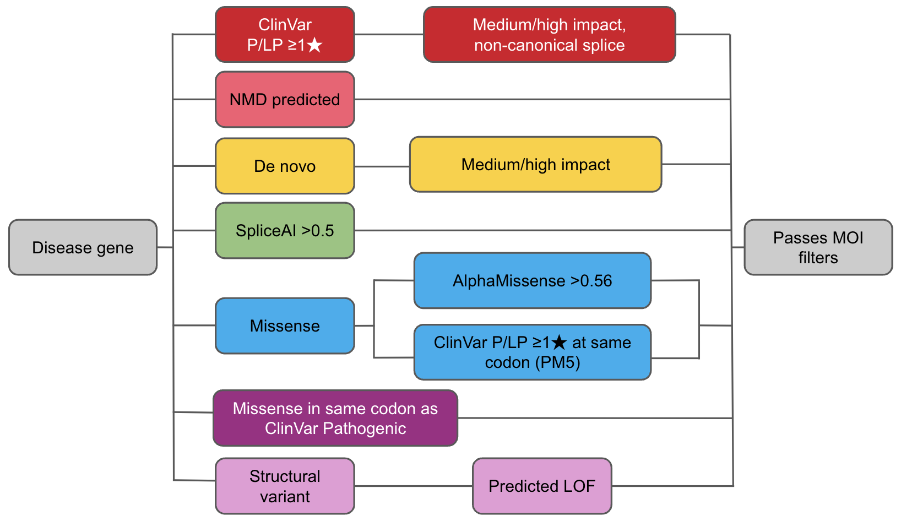

# Talos

[](https://github.com/astral-sh/ruff)  

## Overview

Talos is a Python variant prioritisation tool which finds variants with diagnostic relevance within large callsets. It incorporates consequence annotation, family structures, participant phenotypes, and existing clinical knowledge to identify variants likely to be relevant to participant phenotypes. It has been configured to do this with high specificity whilst retaining maximal sensitivity to reduce burden on curators.

Analysis consists of three main phases:

1. Selection of Gene Panel for the analysis
   * To ensure a highly specific analysis, we base the analysis on known Mendelian disease genes (with their corresponding Mode of Inheritance, MOI)
   * If phenotypic data is provided for participants, we create a personalised gene panel for each participant. This is done by matching between the HPO terms assigned to the participant, and disease-specific panels in PanelApp which are tagged with relevant HPO terms.
   * If no phenotypic data is provided, we use the default Mendeliome for all participants.
2. Variant Categorisation
   * We have created a number of `categories`, each represents a decision tree of criteria.
   * If a variant passes all criteria of a category, it is labelled with that category.
   * If a variant passes multiple categories, it is labelled with all applicable categories.
   * Once all categories have been applied, any un-categorised variants are removed.
3. Mode of Inheritance (MOI) Checking
   * For each remaining variant, we check if the variant's presence in members of the family is consistent with the MOI associated with the gene it is found in.
     * This includes checking for individual variants and compound-heterozygotes between multiple different variants.
   * If the variant is consistent with the MOI, the variant is retained for a final report.

## Installation

> **_NOTE:_**  This repository contains some large files, tracked with [git-lfs](https://github.com/git-lfs/git-lfs). If you don't already have git-lfs installed, we recommend you install it prior to cloning this repository. The [README](large_files/README.md) for the files in question describes their source if you intend to download them separately.


At this time the recommended way to use this tool is via Docker, building using the Dockerfile in this repository.

The Dockerfile offers two builds, use the `--target` flag to specify which build you want to use. To only build the required layers, ensure `DOCKERBUILDKIT` is set to `1` in your environment.

- one for a non-cloud environment (default, called `talos_none`)
- one for a Google cloud environment (called `talos_gcloud`).

```bash
DOCKERBUILDKIT=1 docker build --target talos_none -t talos:6.6.3  .
```

## Workflow Demonstration with Nextflow

A Nextflow pipeline is provided to demonstrate how to run Talos. This pipeline is designed to be run on a local machine, and requires that you have nextflow installed locally, and a docker daemon running. First, as described above, build the docker image:

```bash
docker build --target talos_none -t talos:6.6.3 .
```

Then, run the pipeline:

```bash
nextflow -c nf_test_inputs/nextflow.config run talos.nf -with-report
```

This will run the pipeline on the test data provided in `nf_test_inputs`. The output will be written to `talos_nf_results`.

`-with-report` is an optional argument here, which generates a detailed run report in the current directory.

## Input Data

To run Talos you will need:

1. Variant data, annotated with VEP. The input can be provided as a Hail MatrixTable or as a multisample VCF

    * Talos uses Hail Query, a PySpark-based query engine, to perform highly parallelised analysis. This requires variants to be stored using the Hail MatrixTable format. If your current workflow uses hail, a MatrixTable can be provided directly as an input.
    * Alternatively a VEP-annotated multi-sample VCF can be provided as input. An additional pre-processing step will convert the VCF to a MatrixTable at run time.
    * Talos is intended to run once per-cohort, not once per cohort. Variant calls from all families/individuals in a cohort should be merged into a single multi-sample file prior to processing with Talos.

2. ClinVar data as generated by ClinvArbitration, both the `clinvar_decisions` and `clinvar_pm5` Hail Tables. This is
   available from the [ClinvArbitration Release Page](https://github.com/populationgenomics/ClinvArbitration/releases), or can be generated using the code and process described in the [ClinvArbitration repository](https://github.com/populationgenomics/ClinvArbitration).
3. A pedigree file, describing the pedigree of the participants in the study ([Pedigree Reference](https://gatk.broadinstitute.org/hc/en-us/articles/360035531972-PED-Pedigree-format))
4. A TOML file containing the configuration for the analysis. [example_config.toml](src/talos/example_config.toml) is a
   good starting point, with comments explaining each modifiable parameter. Changes you may wish to make to tailor
   analysis to the cohort under test are using `forced_panels` to involve additional gene panels in the analysis,
   removing or extending the `require_pheno_match` list, which would mask noisy variants from the base panel, and
   `forbidden_genes` to remove genes from the analysis completely.
5. [Optional] A JSON file detailing a GA4GH compliant Cohort ([see reference](https://phenopacket-schema.readthedocs.io/en/latest/cohort.html)). This should contain Phenotypic Features for all relevant participants using HPO terms. If provided this improves matching of panels to participants. If you previously generated the 'extended PED' file in place of the phenopackets file, there is a conversion script [here: convert_ePED_to_phenopackets.py](src/talos/CPG/convert_ePED_to_phenopackets.py) which will convert the extended PED file to a Phenopackets file and regular pedigree.

## Usage

Talos consists of the following components:

- `VcfToMt` - An adapter step for converting an annotated VCF to a MatrixTable.
- `MakePhenopackets` - This is a CPG-specific implementation for generating a Cohort/Phenopacket file. It can serve as a template for generating a compliant Phenopackets input file.
- `GeneratePanelData` - [optional] Phenopacket file, and generates a per-participant list of panels to be used for this analysis, writing the result as a JSON. This also requires a local copy of the HPO ontology, downloadable from [here](http://purl.obolibrary.org/obo/hp.obo).
- `QueryPanelapp` - Takes the output of `GeneratePanelData`, or None if no PhenoPacket file was provided, Queries PanelApp for the panels selected for the cohort, and writes the result as a JSON.
- `FindGeneSymbolMap` - Uses the output of `QueryPanelapp` to find the gene symbol for each gene ID via Ensembl's REST API.
- `RunHailFiltering` - Takes the MatrixTable of Variants, the Pedigree file, the panel data from `QueryPanelapp`, and
  both ClinVar tables, filters the variants in the MatrixTable, and labels them with categories of interest. This is the most resource-intensive step of the pipeline, but even on 400+GB datasets it has been run successfully on a 8-core, 16GB RAM VM.
- `RunHailFilteringSV` - Takes a MatrixTable of Structural Variants, the Pedigree file, the panel data
  from `QueryPanelapp`, filters the variants in the MatrixTable, and labels them with categories of interest.
- `ValidateMOI` - Takes the result of `RunHailFiltering`, optionally one or more SV result from `RunHailFilteringSV`,
  the Pedigree, and panel data from `QueryPanelapp`. Checks each categorised variant to determine whether the MOI
  associated with the relevant gene fits within the family structure where it occurs. Generates a JSON file from all
  variants which pass the MOI tests.
- `HPOFlagging` - Takes the results of `ValidateMOI`, and uses semsimian to test whether the HPO term(s) associated with the gene matches the HPO term(s) associated with the participant.
- `CreateTalosHTML` - Generates a report from the results of the `ValidateMOI`.
- `MinimiseOutputForSeqr` - Parses the result of `ValidateMOI`, generates a file for ingestion by Seqr.

[example_usage.sh](example_usage.sh) demonstrates a full execution of Talos. This should be worked up into a workflow language script, but this bash script should suffice as guidance.

## Categories



This is a highly simplified representation of the categories currently implemented.

## ClinvArbitration

See the companion [ClinvArbitration](https://github.com/populationgenomics/ClinvArbitration) repository for more details.

Talos uses ClinVar submissions to determine if a variant has been previously reported as Pathogenic or Likely Pathogenic. For the purpose of a Talos analysis, when multiple submissions for the same variant have conflicting classifications, we would prefer to favour the classifications provided by high-quality recent submitters. To enable this, we have ClinvArbitration, a re-aggregation of ClinVar submissions uses altered heuristics favouring decisions. This avoids the default logic used by clinvar which cautiously assigns "conflicting interpretations of pathogenicity" unless there is perfect harmony among all submissions.

In addition to providing the top-line rating, ClinvArbitration also re-indexes ClinVar variants based on the transcript and codon they alter. Talos uses this table to identify any missense variants impacting a codon previously reported to be altered by a pathogenic variant in ClinVar and assign the `PM5` evidence category.

ClinvArbitration is used to re-process ClinVar releases periodically and the ready-to-use results are available via the ClinvArbitration repository's Release page.

## Exomiser Integration

[Exomiser](https://github.com/exomiser/Exomiser) is a similar tool in this space, running variant prioritisation based on variant annotations and matching genes to participant phenotypes. In our benchmarking cohorts we've found that performance of Talos and Exomiser are comparable when used independently, but when the two analyses are combined, they perform better than either in isolation. To that end we have facilitated the integration of Exomiser variants into Talos analyses. If you have previously generated Exomiser (v14) results, the script [CombineExomiserVariantTsvs.py](src/talos/CombineExomiserVariantTsvs.py) will aggregate the per-proband TSVs into a single JSON file, and write the results as a Hail Table. This Hail Table can be passed to `RunHailFiltering`, with variants prioritised by Exomiser annotated in as another data source. In the HTML report, an `Exomiser` column will display the rank and Mode of Inheritance (MOI) of the variant in the Exomiser reports.

This preparatory script expects that the Exomiser Variant analysis TSVs have the naming convention `PROBAND.variant.tsv`, where PROBAND is the name of the proband in the cohort/VCF/MatrixTable.

## Reanalysis

The heart of Talos' utility is in re-analysis, by bootstrapping from previous analyses. Where possible each run consults the history from the previous run, determining whether each variant has been seen before, and if so, whether evidence has evolved. Each run adds the incremental content, and re-saves the history.

The final report contains a `first_seen` date for each variant, along with an `evidence_last_updated` date which indicates the most recent date that the evidence changed (new category labels were applied). By filtering on either of these dates, analysts can view only the incremental variants new in each round, or variants where the evidence has changed.
