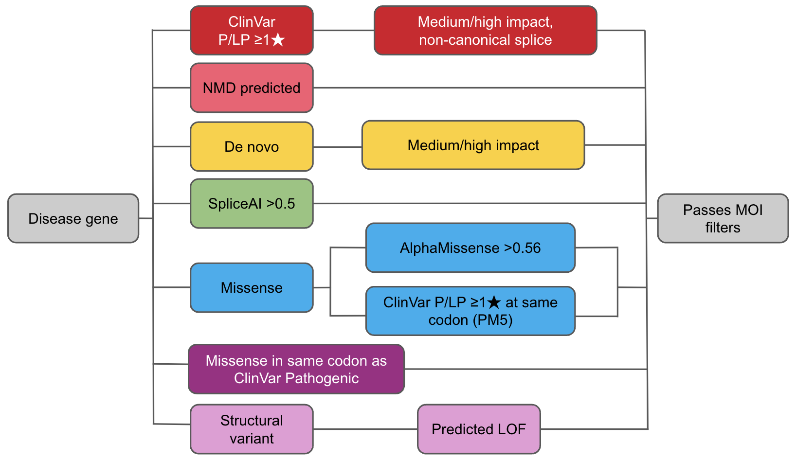

# Talos

[](https://github.com/astral-sh/ruff)


## Overview

**Talos** is a variant prioritization tool designed to identify clinically relevant variants from genomic callsets. It integrates annotations, pedigree data, phenotypes, and curated clinical knowledge to highlight variants that may underlie a participant’s phenotype. Talos emphasizes **high sensitivity** and **high specificity**, minimizing the review burden for analysts.

It supports both small-scale (e.g., single-family) and large-scale (e.g., thousands of samples) analyses, performing family-based evaluations independently of cohort size.

<details>
<summary><strong>Performance Summary</strong></summary>

* \~1 variant returned per proband
* \~2 variants for singletons
* \~25% of returned variants are clinically relevant
* \~40% of variants flagged for special attention are clinically relevant

**Resource Usage** (demo on toy data):

* Annotation: \~2 min
* Talos run: \~5 min
* Hardware: 2 cores, 8 GB RAM

> For performance tracking and improvements, please use `-with-report` and share output details with us.

</details>

---

## 🚀 Quick Start

Talos contains a demonstration workflow implemented using **Nextflow**, with containerized execution via Docker. With a few modifications, this Nextflow pipeline can be adapted to run on your own real data.

### 1. Install Requirements

* [Nextflow](https://www.nextflow.io/docs/latest/install.html)
* Docker

* Build the image:

  ```bash
  docker build -t talos:7.4.1 .
  ```

### 2. Download Annotation Files

* Some Large files needed for annotation must be downloaded to a `large_files` directory. See the [large\_files README](large_files/README.md) for details.

### 3. Run Annotation Workflow

```bash
nextflow -c nextflow/annotation.config \
  run nextflow/annotation.nf \
  [--large_files <path>] \
  [--processed_annotations <path>] \
  [--merged_vcf <path>]
```

### 4. Run Talos Workflow

```bash
nextflow -c nextflow/talos.config \
  run nextflow/talos.nf \
  --matrix_table nextflow/cohort_outputs/cohort.mt
```

---

## 📥 Inputs

You will need:

1. **VCFs** – Individual VCFs or pre-merged
2. **Pedigree file** – PED format ([spec](https://gatk.broadinstitute.org/hc/en-us/articles/360035531972-PED-Pedigree-format))
3. **\[Optional] Phenopackets** – For phenotype-driven gene panel generation
4. **ClinVar data** – Pre-processed by [ClinvArbitration](https://github.com/populationgenomics/ClinvArbitration), see [large_files](large_files/README.md#talos-workflow)
5. **Config file (TOML)** – See [`example_config.toml`](src/talos/example_config.toml) as a baseline example, and [Configuration.md](docs/Configuration.md) for extended details

> **NOTE** the ClinvArbitration data is updated and re-uploaded monthly. A Stub has been provided in this repository, matching the dummy test data (`nextflow/inputs/clinvarbitration.tar.gz`) but that is not suitable for real analyses (only contains 4 variants).

---

## 🔬 Analysis Pipeline

<details>
<summary><strong>1. HPO Panel Matching (optional)</strong></summary>
If phenotype data is provided via Phenopackets, Talos selects gene panels from PanelApp that match reported HPO terms.
</details>

<details>
<summary><strong>2. PanelApp Integration</strong></summary>
Combines phenotype-driven panels with a default Mendelian gene panel to broaden coverage.
</details>

<details>
<summary><strong>3. Variant Filtering & Categorization</strong></summary>
Applies hard filters (e.g., population frequency, artifact removal), then classifies remaining variants via a decision-tree framework.
</details>

<details>
<summary><strong>4. Mode of Inheritance (MOI) Validation</strong></summary>
Checks whether variant inheritance patterns align with reported family structure and expected MOI.
</details>

<details>
<summary><strong>5. Phenotype Match Scoring (optional)</strong></summary>
Uses semantic similarity to compare variant-associated genes to the proband’s HPO terms.
</details>

<details>
<summary><strong>6. Report Generation</strong></summary>
Creates individual and cohort HTML reports, including:
- Variant categories and flags
- Inheritance consistency
- Phenotype scores (if applicable)
- Evidence sources and provenance
</details>

---

## 🧱 Components

| Component               | Purpose                                      |
| ----------------------- | -------------------------------------------- |
| `MakePhenopackets`      | Build valid Phenopackets                     |
| `DownloadPanelApp`      | Fetch monthly PanelApp snapshot              |
| `UnifiedPanelAppParser` | Create gene panels from phenotype + PanelApp |
| `RunHailFiltering`      | Core SNV/indel filtering and categorization  |
| `RunHailFilteringSv`    | Structural variant filtering                 |
| `ValidateMOI`           | MOI checks vs. pedigree                      |
| `HPOFlagging`           | HPO-based prioritization                     |
| `CreateTalosHTML`       | HTML report generation                       |
| `MinimiseOutputForSeqr` | Output for Seqr ingestion                    |

---

## 🔗 Integration

<details>
<summary><strong>ClinvArbitration</strong></summary>

Talos uses [ClinvArbitration](https://github.com/populationgenomics/ClinvArbitration) to:

* Resolve conflicting ClinVar submissions
* Favor trusted submitters (e.g., diagnostic labs)
* Normalize variant classification at the codon level
* Assign PM5 evidence

</details>

<details>
<summary><strong>Exomiser Support</strong></summary>

Talos can incorporate [Exomiser](https://github.com/exomiser/Exomiser) output:

```bash
src/talos/AggregateExomiserVariantTsvs.py
```

This script aggregates variant TSVs into a Hail Table for filtering integration.

</details>

---

## 🔁 Reanalysis

Each Talos run includes historical tracking of variants:

* `first_seen`: when the variant was first detected
* `evidence_last_updated`: last classification change

This enables identification of newly updated or reclassified variants over time. To enable this behaviour, add a `result_history` value into the configuration, pointing to a directory which is accessible at runtime. See [Configuration.md](docs/Configuration.md) for details

---

## 🧪 Categories

Variants are tagged with one or more **Talos categories** based on clinical, computational, and pedigree evidence.

<details>
<summary><strong>View Category Diagram</strong></summary>



</details>

---
