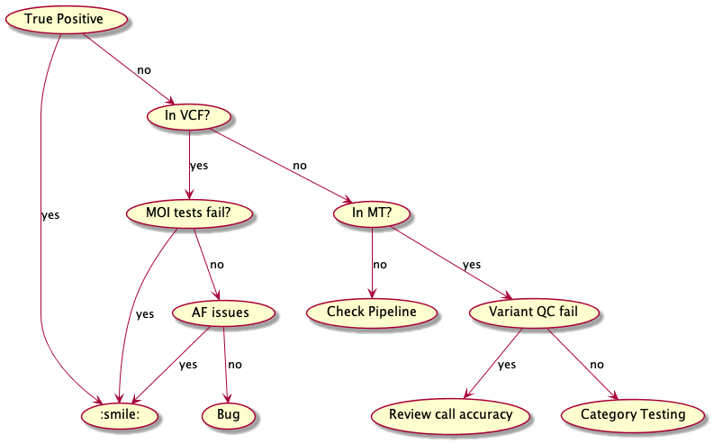
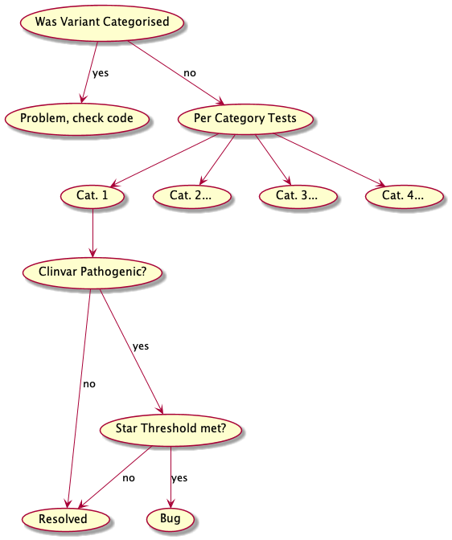

# Comparison

Comparison of the results generated by this process against an external 'truth' will be crucial to successful
development and refinement. This will help us understand results in terms of Sensitivity/Specificity, and crucially
to understand _why_ expected variants are missing from the final outputs. Where we can pinpoint why variants evade the
current category/MOI assignment, this can lead us to either de-bugging faulty implementation, or to refine the design of
parts of the algorithm.

For context there are some key data sources relevant to this comparison:

1. The MatrixTable (MT) containing annotated variants:
   - This includes all variants from a joint-call, annotated with VEP and other sources. All annotations used in
   determining whether a variant is categorised initially will be present in this data source..
2. The Labelled Variant Call Format File (VCF):
   - A key step of AIP is analysing the variants present in the MT, and labelling those which meet specific criteria
   (see [relevant documentation](../design_docs/Hail_Filter_and_Label.md)). All variants selected into at least one relevant category
   are retained, and the process outputs a VCF file. For comparison purposes, we understand that when the process works
   correctly, all variants present in the MT and missing from the VCF were not selected as important.
3. The final results JSON:
   - After variants are selected and labelled, the next stage is Mode of Inheritance (MOI) testing. This takes external
   sources of gene-specific information, and tests if the labelled variants segregate appropriately within families.
   Variants present in the Labelled VCF and not in the final results are explained if the MOI for that specific gene did
   not conform to the expected MOI.

There are 3 key phases of this analysis where variants can 'drop-out', and identification of these will help undestand,
and potentially resolve any discrepancies against the Truth dataset:

1. During Variant calling: it's possible that true variants were never present in the joint call
    - resolution here would be through returning to the calling pipeline, or raw data
2. During category assignment: variants can drop out due to QC issues, or lack of relevant annotations
   - expected variants may not be present on the panel of interest
   - variants could fail one of the quality filters (AB ratio, Variant Caller assigned `Filters`, too common within the
   joint-callset)
   - annotations may not pass one of the defined categories (e.g. no VEP `HIGH` consequence anno., AF too high in
   Gnomad/ExAC, ClinVar results are conflicting)
3. During MOI checking: variants may be categorised, but may not fit within the PanelApp-sourced MOI
   - e.g. a strong Het. will be excluded if the PanelApp MOI is Biallelic only
   - variant may not segregate appropriately within the family

## Inputs

1. Input representing the AIP results will be provided using the summary JSON format
2. 'Truth' data will be provided using the Seqr tagged variant export table, but could be generalised (e.g. for acute-care,
download the table from [e.g. saved variants](https://seqr.populationgenomics.org.au/project/R0011_acute_care/saved_variants))

Input data from both sources will be translated into a common format:

```python
from comparison.comparison import CommonFormatResult

results = {
    'sample_ID': [
        CommonFormatResult('chr', 'pos', 'ref', 'alt', ['confidence']),
        CommonFormatResult('chr', 'pos', 'ref', 'alt', ['confidence']),
    ],
    'sample_ID_2': [
        CommonFormatResult('chr', 'pos', 'ref', 'alt', ['confidence']),
        ...
    ]
}
```

The majority of the input files (AIP outputs, AIP labelled VCF, PanelApp data, config file, pedigree) are located
relative to the root run folder, so running via the wrapper is simple. The 3 arguments when using the wrapper are:

- Seqr Tags CSV
- MT used as input for AIP run
- AIP analysis folder

---

## Process

A brief algo of the comparison process - this is a tree-style walking through variants, first at a high level `is this
variant matched successfully, or not`, `is this variant in the labelled VCF, or not`, then for variants not yet
explained the searches become progressively more specific: `which element of the quality filter failed`, `which element
of the Category 1 filter criteria was failed`.

1. Parse both AIP and external results into a common format
2. Compare AIP + Ext. data, find `True Positives` and discrepancies
   - At this point the top-line results are logged to GCP in JSON format
3. For each Discrepancy:



At a more granular level, a check will run for each category, initially testing whether a category flag was applied,
then testing each separate component of that category logic if not:



For each failing test, a descriptive String will be generated. The collection of Strings should explain the reason for
each variant avoiding categorisation, e.g.

```python
reasons = [
   'Cat. 1: Clinvar rating: Benign',
   'Cat. 1: Clinvar Stars: 1',
   'Cat. 2: Gene not new in PanelApp',
   'Cat. 3: No VEP HIGH CSQ',
   'Cat. Support: not Missense'
]
```

The summary of all reasons will be exported, and when the comparison detects that a category should have been assigned,
this will be flagged for manual review.

## Identifying Correct Participant(s)

When parsing input data from both sources (Seqr, AIP JSON) there are two key elements:

1. definition of the variant(s) identified
2. sample(s) for whom each variant is thought to be causative

Both of these elements are crucial, because all downstream comparisons are run on a sample-by-sample basis.

Part 1) is simple - a variant can be completely defined in terms of chr-pos-ref-alt, so we can happily use that string
to match between different datasets. We normalise the chromosome name in all cases (removing any `chr` prefix, and
making contig names UPPERcase).

Part 2) is trickier; AIP results are heirarchically organised by sample, with variants which could be causing their
phenotype nested under sample ID. Seqr results don't have this heirarchical logic, with each row in the TSV containing
all samples and corresponding genotypes.

To handle this situation appropriately, we use the following approach:

- Parse AIP data, creating a sample ID-indexed list of all variants
- Parse Pedigree, finding all affected individuals across all families
- Parse Seqr table:
  - Create an object representation of each variant
  - Find all affected samples on the row with a non-WT genotype
  - Append the variant to each affected sample's list

During an AIP run, for each categorised variant, we assess whether the MOI fits for each affected person with a variant
at that site. This means the AIP output can contain each passing variant for each affected participant separately. As an
equivalent, we apply each variant from a seqr row to every affected sample.

The worst case scenario is that this approach adds a few extra discrepancies, but this output is for manual review, and
that situation should be easy to spot and resolve.

## Improvements

The current algorithm risks running the comparison tests multiple times on the same variant (particularly if there are
multiple affecteds in the same family). The MT-portion of the algorithm should be refined from the current comparison:

### Current

1. find all discrepancies for each sample
2. find which of those discrepant variants weren't present in the VCF (un-classified in the Hail stage)
3. for each of those discrepant variants, find all corresponding reasons

### Change to

1. retain steps 1 & 2
2. Pool all unique variants across all samples
3. Run algorithm once per variant, instead of once per sample:variant
4. Once all variants are annotated with reasons, recover results per-sample

This means that if the same variant is found in 10 families, the long-running Hail comparisons would run once, instead
of 10 separate times.
