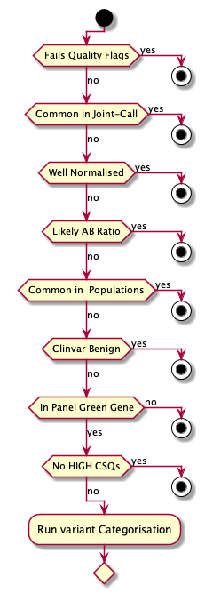
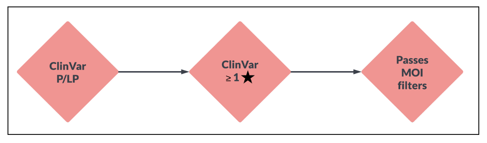
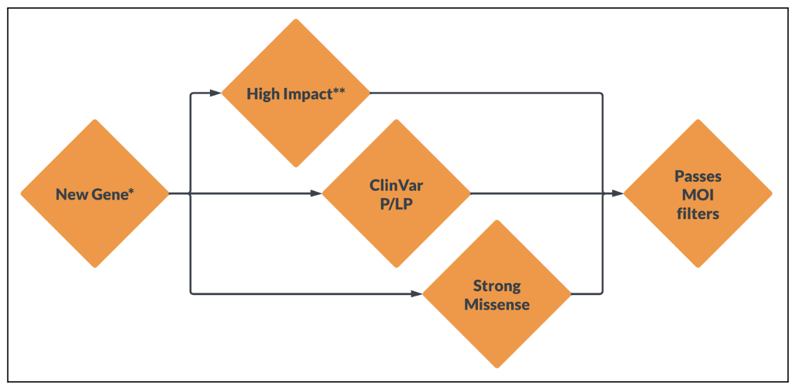
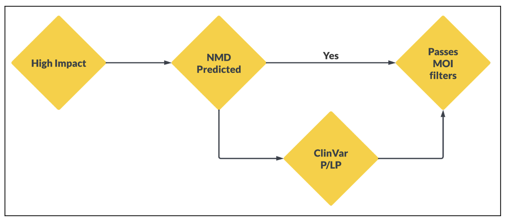
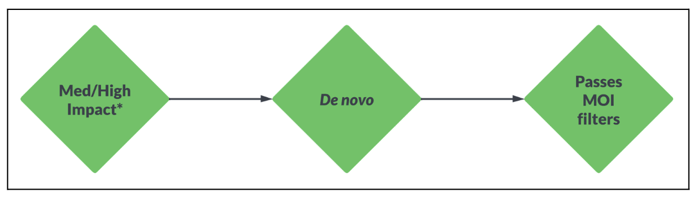
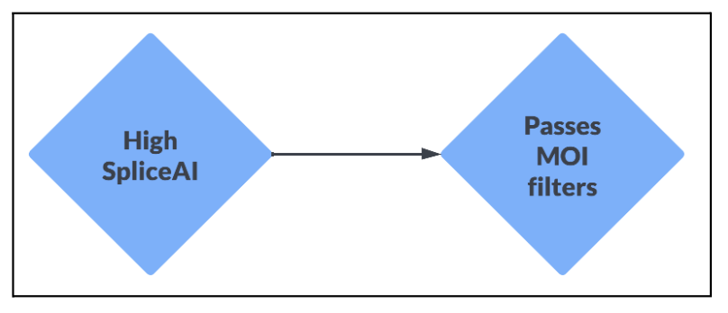
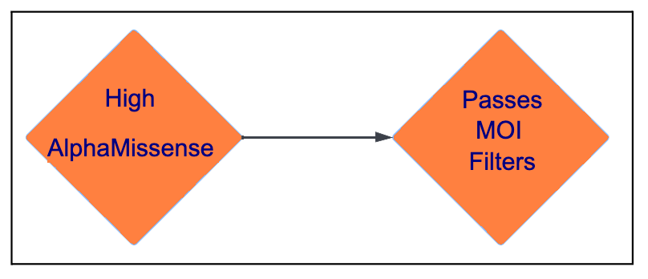
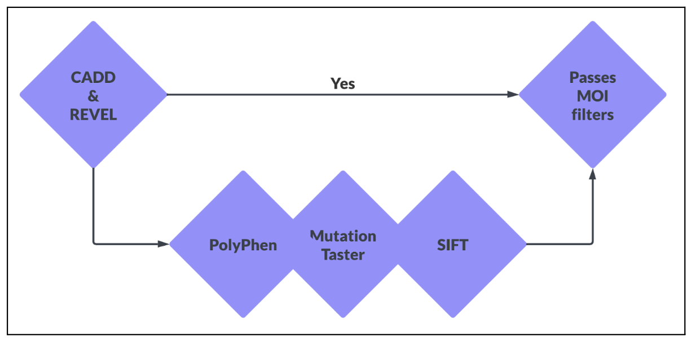

# Hail Query Stage

This stage of the workflow uses hail query to load, filter, and apply provisional categories to variants.

[hail_filter_and_label.py](../reanalysis/hail_filter_and_label.py)

## Stage Details

Runs within a Hail Batch, as a Hail Query runtime.

---

Takes an annotated VCF in Hail MatrixTable format, adds category classifications based on the variant annotations. These
diagrams describe the logic used to select variants into each category. Assignment of each category is independent, and
variants can have multiple categories assigned.

### Pre-category filtering process

This shows the progressive filters applied to each variant to reduce the search space when running the category tests

### Category 1

### Category 2

### Category 3

### Category 4 (de novo)

### Category 5

### Category 6

### Category Support

For Category 2, a gene being `New` is contextual. The program permits several methods:

1. provide a gene list (symbols) - a gene will be considered `new` if it is Green in PanelApp and not within this list
2. provide a prior version of a panel - a gene is `new` if it has become Green on the panel since this prior version
3. (future) provide previously parsed panel data - a gene is `new` if Green, and was not present during prior analysis

This includes the proposed, but not yet implemented, use of SpliceAI results. There are two possible uses, and one
(or both) will be implemented once the proposal has been refined

1. Category 5 will exist solely for high-confidence SpliceAI annotations
2. Support will feature Mid-Strength SpliceAI predictions

---

### Input

Annotated Joint-called MatrixTable. Annotations applied either by, or consistent with, the prior annotation step.

---

### Process

1. Read reference files (PanelApp data, [Configuration](../reanalysis/reanalysis_global.toml))
    * From the PanelApp data, pull `ENSG` values corresponding to GREEN (High Confidence) genes
    * Most of the steps are configurable based on this file, e.g. the definition of `common in joint call` is a
      balance of the 2 parameters `min_samples_to_ac_filter`, and `ac_filter_percentge`.
    * All the config file parameters related to the Hail stage are contained within the top level key `filter`

2. Read Annotated MatrixTable
    * If the expected MT path exists, read directly (else fail)

3. Pull useful annotations from the `vep.*` data structure into the `INFO` fields
    * Centralising variables makes for cleaner downstream code
    * Allows for missing values to be replaced with defaults so that hail filter operations all work
    * Eventually when writing out to a VCF, only annotations in `mt.info` are retained, so to retain these data we have
      to reposition within the MT structure

4. Filter annotated variants
    * Common variants, based on ExAC/GnomAD frequencies
    * Variants without any [Green-Gene](https://panelapp.agha.umccr.org/panels/137/) consequences
    * Consequences unlikely to be impactful or on non-protein-coding transcripts are removed
        * ... followed by removal of any variants with no remaining consequences

5. Apply custom category labels, as defined in the flowchart above
    * Annotations are provisional, as mode-of-inheritance confirmation is not in Hail
        * _De Novo_ is an outlier here, as the _de novo_ flag is validated within Hail

6. Remove any variants with no successful categories applied
    * When we consider compound-hets & modes of inheritance, consider only variants with at least one assigned category
    * Removal of un-categorised variants means that all remaining variants can be treated as candidates

7. Concatenate all per-transcript consequences remaining after filters into a single VEP-style `CSQ` field

8. Write the Variants out as a VCF

---

### Types of Category flags

To make downstream operations easier, the different categories are grouped into types. There are currently 3 types:

1. Boolean - The category is a binary flag, either the variant has the flag assigned or does not. These flags are based
   on the *variant* annotations, so the flag will apply equally to all samples with an alt call at that position
2. Samples - The category is a list of sample IDs or 'missing'. This type indicates that the flag has been assigned to
   only the identified samples, rather than all samples with the variant call. An example of this is _de novo_, where
   the assignment of the flag is conditional on the MOI, so this won't apply to all samples with a variant call. When
   processing these variants, only variant calls for samples in this list are treated as being categorised
3. Support - Any flag starting with _CategorySupport_ is treated equally, but inferior to all other Categories. This
   means that the Support flags are never enough to categorise a variant alone, but may support a separate categorised
   variant in a compound inheritance MOI. If a variant has a Support flag & non-support flags, it will be treated as an
   independent variant
4. Details - Any flag starting with _CategoryDetails_ is processed in some way upon ingestion of the VCF. The content of
   the category label can be anything, with the intention that when each variant is read it is converted into a Boolean
   or Sample label. The only current implementation of this is the PM5 label. The flag content in this case is a list of
   all clinvar Pathogenic missense alleles which affect the same residue as this current variant. Upon ingestion of the
   variant, the collected AlleleIDs are split, filtered to unique, and any exact matches to the current variant are
   removed. If there are remaining AlleleIDs in the list, an entry is made in the variant's info dictionary (for
   rendering
   downstream in the report) and a flag CategoryBooleanPM5 is assigned. This then acts as a regular boolean flag, with
   the pm5 data in the dictionary available for display if appropriate. This approach means that upon creation and init
   processing of the AbstractVariant, the CategoryDetails flag no longer exists, and no advanced logic is needed to
   process
   it within the MOI logic.

### USP - ACMG PM5

The latest Category included into AIP is _CategoryDetailsPM5_, which is used to determine whether the ACMG/AMP 2015
variant interpretation framework evidence type is suitable. This evidence is applied when a novel missense change
creates a residue substitution at the same codon as a previously seen missense classified as Pathogenic in ClinVar.

This category requires some pre-processing as follows (note: this is the exact method used so far based on CPG
infrastructure, there may be easier ways to accomplish the preparatory stems in alternative deployments):

* Acquire the latest VCF format file containing all the variants in ClinVar
* Annotate this VCF using VEP, outputting a MatrixTable data structure
* Using the code in [reanalysis/clinvar_by_codon.py](../reanalysis/clinvar_by_codon.py), reorganise this data into a
  lookup table, with all protein & residues as keys, linked to all co-located clinvar Alleles. See [Clinvar By Codon](
  Helpers.md#clinvar-by-codon-clinvarbycodonpy) for details. Save that Hail Table to a common location as an input
  file.

| Residue affected | ClinVar Alleles                                           |
|------------------|-----------------------------------------------------------|
| ENSP12345::123   | AlleleID::Pathogenic::#Stars                              |
| ENSP67890::678   | AlleleID::Pathogenic::#Stars+AlleleID::Pathogenic::#Stars |

* During the Hail labelling runtime, import that Codon-indexed-ClinVar table
* Do a similar re-indexing to shuffle the real cohort callset data into a similar format; filter to missense variants,
  index on the protein ID, and aggregate to contain all individual variants which cause a change at that residue:

| Residue affected | Variants                         |
|------------------|----------------------------------|
| ENSP12345::123   | [chr2:123456:A:C]                |
| ENSP67890::678   | [chr4:67899:A:C, chr4:67890:G:C] |

* Join the tables of ClinVar and real variant data, then explode and aggregate by variant. The resulting table is
  indexed
  on variant Locus & Alleles, and connects each variant with _all pathogenic ClinVar missenses which affect this
  residue_

| Variant         | ClinVar Alleles                                           |
|-----------------|-----------------------------------------------------------|
| chr2:123456:A:C | AlleleID::Pathogenic::#Stars                              |
| chr4:67890:G:C  | AlleleID::Pathogenic::#Stars+AlleleID::Pathogenic::#Stars |
| chr4:67899:A:C  | AlleleID::Pathogenic::#Stars+AlleleID::Pathogenic::#Stars |

* This table is then used to annotate the callset MT - if the variant exists in this table, the CategoryDetailsPM5
  content
  is the string of related ClinVar content, otherwise the value is set to `missing`
