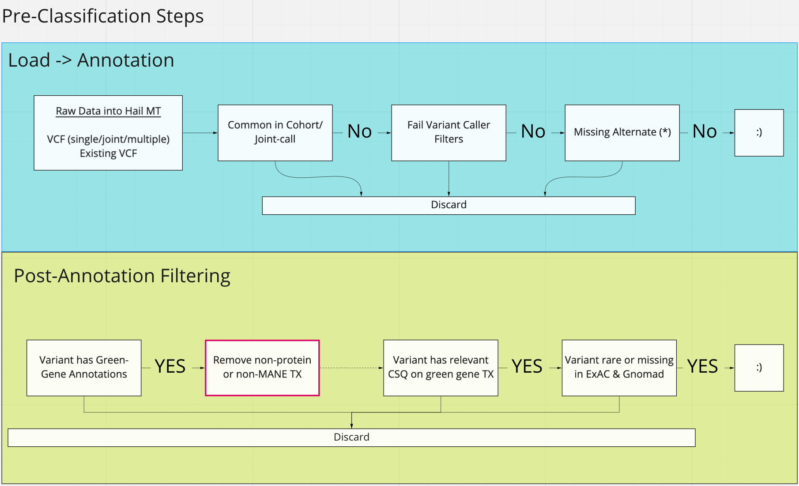
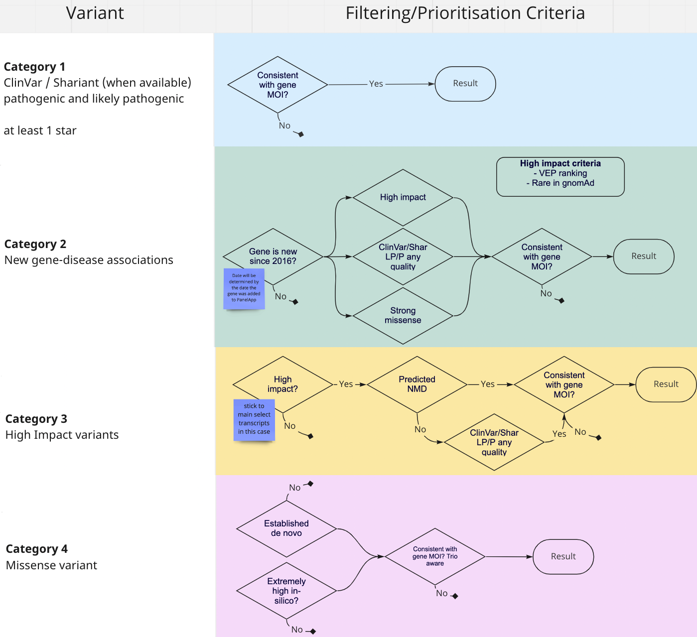

# Hail Query Stage

This stage of the workflow uses hail query to load, annotate, and apply provisional categories to variants.

[hail_filter_and_categorise.py](../reanalysis/hail_filter_and_label.py)

## Stage Details

Runs within a Hail Batch, as a Hail Query runtime.

---

### Note

For now, due to limitations of the annotation process, we are reliant on an annotated MatrixTable being provided
as input. Substantial amounts of code and input data would have to be provided for this to work independently from
the CPG pipeline environment, so in the interest of first merging an end-to-end product, then improving, the annotation
phase has been extracted.

Please ignore statements below concerning the running of VEP/Dataproc, as they have been (temporarily) removed

---

This stage takes a Hail MatrixTable representation of a VCF as input, applies VEP annotation, and adds provisional
category tags. Flow chart representations of the logic for pre-and post annotation filters are shown below

Criteria for selection into the 4 variant categories

---

### Input

Designed for joint-called MatrixTable. This is due to current reliance on the Seqr-loader
pipeline at the CPG, which handles the transition from raw reads to clean, joint called, [GATK Best-Practice](https://gatk.broadinstitute.org/hc/en-us/articles/360035535932-Germline-short-variant-discovery-SNPs-Indels-)
prepared variant data.

If this process is opened up in future so that VCFs or alignment data is used, this will need to be adapted, or a pre-processing step created.

---

### Process

1. Read reference files (PanelApp data, [Configuration](../reanalysis/reanalysis_conf.json))
   * From the PanelApp data, pull `ENSG` values corresponding to GREEN (High Confidence) genes
   * Most of the steps are configurable based on this file, e.g. the definition of `common in joint call` is a balance of the 2 parameters `min_samples_to_ac_filter`, and `ac_filter_percentge`.
   * All the config file parameters related to the Hail stage are contained within the top level key `hail`

2. Read MatrixTable
   * If the expected post-annotation MT path exists, read directly (reduces time taken when re-running)
   * If the post annotation target path doesn't exist, read, pre-filter (see flow chart above), annotate with VEP, and write out as MT

3. Pull useful annotations from the `vep.*` data structure into the `INFO` fields
   * Centralising variables makes for cleaner downstream code
   * Allows for missing values to be replaced with defaults so that hail filter operations all work
   * Eventually when writing out to a VCF, only annotations in `mt.info` are retained, so to retain these data we have to reposition within the MT structure

4. Filter annotated variants
   * Common variants, based on ExAC/GnomAD frequencies
   * Benign variants, based on confident Clinvar annotations
   * Variants without any [Green-Gene](https://panelapp.agha.umccr.org/panels/137/) consequences
   * Consequences unlikely to be impactful or on non-protein-coding transcripts are removed
     * ... followed by removal of any variants with no remaining consequences

5. Apply custom category labels, as defined in the flowchart above
   * All these annotations are provisional, as mode-of-inheritance confirmation is not in Hail (yet)
   * Confirmation of categories is done in a downstream stage

6. Remove any variants with no successful categories applied
   * We treat categorised variants as an in-group. When we later consider compound-hets & modes of inheritance, we only consider variants with at least one category
   * Removal of un-categorised variants means that all remaining variants can be treated as candidates

7. Concatenate all per-transcript consequences remaining after filters into a single VEP-style `CSQ` field

8. Sweep over the whole MatrixTable, and calculate all compound-het pairings for each sample
   * Combines a gene-grouped aggregation with a sample-level heterozygous aggregation
   * This is post-filtered to remove any category-4 only pairings
   * Note, this doesn't currently consider phase
   * Export the JSON output to a GCP bucket path

9. Write the Variants out as a VCF
