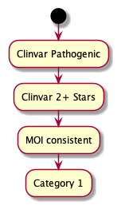
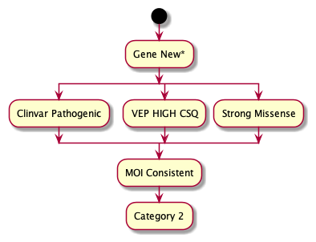
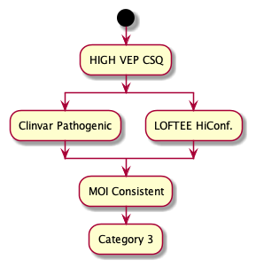
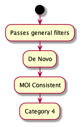
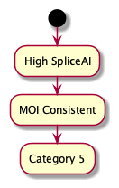
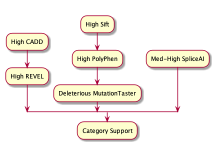

# Hail Query Stage

This stage of the workflow uses hail query to load, filter, and apply provisional categories to variants.

[hail_filter_and_label.py](../reanalysis/hail_filter_and_label.py)

## Stage Details

Runs within a Hail Batch, as a Hail Query runtime.

---

Takes an annotated VCF in Hail MatrixTable format, adds category classifications based on the variant annotations.

This shows the progressive filters applied to each variant to reduce the search space when running the category tests

These diagrams describe the logic used to select variants into each category. Category assignment is indepedent in each
case, and variants can have multiple categories assigned.

For Category 2, a gene being `New` is contextual. The program permits several methods:

1. provide a gene list (symbols) - a gene will be considered `new` if it is Green in PanelApp and not within this list
2. provide a prior version of a panel - a gene is `new` if it has become Green on the panel since this prior version
3. (future) provide previously parsed panel data - a gene is `new` if Green, and was not present during prior analysis

This includes the proposed, but not yet implemented, use of SpliceAI results. There are two possible uses, and one
(or both) will be implemented once the proposal has been refined

1. Category 5 will exist solely for high-confidence SpliceAI annotations
2. Support will feature Mid-Strength SpliceAI predictions

---

### Input

Annotated Joint-called MatrixTable. Annotations applied either by, or consistent with, the prior annotation step.

---

### Process

1. Read reference files (PanelApp data, [Configuration](../reanalysis/reanalysis_conf.json))
   * From the PanelApp data, pull `ENSG` values corresponding to GREEN (High Confidence) genes
   * Most of the steps are configurable based on this file, e.g. the definition of `common in joint call` is a balance of the 2 parameters `min_samples_to_ac_filter`, and `ac_filter_percentge`.
   * All the config file parameters related to the Hail stage are contained within the top level key `hail`

2. Read Annotated MatrixTable
   * If the expected MT path exists, read directly (else fail)

3. Pull useful annotations from the `vep.*` data structure into the `INFO` fields
   * Centralising variables makes for cleaner downstream code
   * Allows for missing values to be replaced with defaults so that hail filter operations all work
   * Eventually when writing out to a VCF, only annotations in `mt.info` are retained, so to retain these data we have to reposition within the MT structure

4. Filter annotated variants
   * Common variants, based on ExAC/GnomAD frequencies
   * Variants without any [Green-Gene](https://panelapp.agha.umccr.org/panels/137/) consequences
   * Consequences unlikely to be impactful or on non-protein-coding transcripts are removed
     * ... followed by removal of any variants with no remaining consequences

5. Apply custom category labels, as defined in the flowchart above
   * Annotations are provisional, as mode-of-inheritance confirmation is not in Hail
       * _De Novo_ is an outlier here, as the _de novo_ flag is validated within Hail

6. Remove any variants with no successful categories applied
   * When we consider compound-hets & modes of inheritance, consider only variants with at least one assigned category
   * Removal of un-categorised variants means that all remaining variants can be treated as candidates

7. Concatenate all per-transcript consequences remaining after filters into a single VEP-style `CSQ` field

8. Write the Variants out as a VCF
