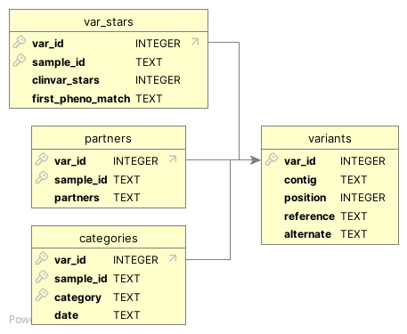

# Putting the "Re" in "ReAnalysis"

With Talos we have created a process which can both analyse data as a one-time event, and run re-analysis, building on previous results with each run. By referencing and building on previous results, we can prioritise new variants (novel classifications, or changed evidence) and reduce the amount of work needed to re-analyse a case by allowing users to filter out variants which were seen previously and have not changed.

Talos does this through storing a representation of each run's results in a database. By reading and updating that database with each new run, we gradually build a record of all previously seen results, each with the original date of its observation. This allows us to see when a variant was first classified, and how its classification has changed over time. This is then reflected in the report, where the date shows the most recent observation of changed evidence.

For NextFlow, this is mediated through the `params.history` config entry, or `--history <database>`, which points to a SQLite database file. If the file does not exist or was not provided, it will be created during the run and popoulated with the current analysis data as its initial content. If a database is passed, it will be updated with and new or changed results discovered during the current run.

## Process

During a run, if a database is provided, Talos will make a copy in the output directory named `talos_history_yyyy-MM-dd_hh_mm.db`, the date of the current run. This preserves the original database contents un-edited. If no database was provided, an initial file will be created during the run using the same name and schema.

During the run, Talos analyses data as standard, then once the result set has been generated the history file is loaded up and current results are compared to its contents. Any new discoveries are added to the database, and a few key variant attributes are updated to reflect their history:

* if a variant is newly detected, it is added to all relevant database tables
* If a variant was seen before:
  * `first_tagged` is set to the date of its first observation, of any category
  * `evidence_last_updated` is set to the most recent date a category was assigned for the first time
  * if a variant was seen before, and is now seen with a novel comp-het partner, `evidence_last_updated` is today
  * `date_of_phenotype_match` is None, if there is no phenotype match, otherwise it is set to the earliest date a phenotype match was observed

## Schema



* `variants` - contains the locus-ref-alt components of a variant
* `categories` - with variant-sample_id-category as a compound key, this contains a row for each categgory seen, and the date it was first observed
* `partners` - with variant-sample_id as a compound key, this contains a comma-delimited list of any partners seen for a variant in comp-het analysis
* `var_stars` - with variant-sample_id as a compound key, this contains the highest ClinVar star rating seen (if any), and the earliest date of a phenotype match (if any)

There is no separate table for Sample details, Talos is not designed to integrate with identifiable participant information, so the sample_id is used as a pseudo-foreign key.

## Legacy results

If you were previously able to generate a result history using the JSON format, [a script has been provided](../src/talos/convert_json_history.py) which will create a new SQLite database file with the same schema as above, which can then be used in future runs.

```bash
python3  convert_json_history_to_db.py previous_results.json new_history.db
```
